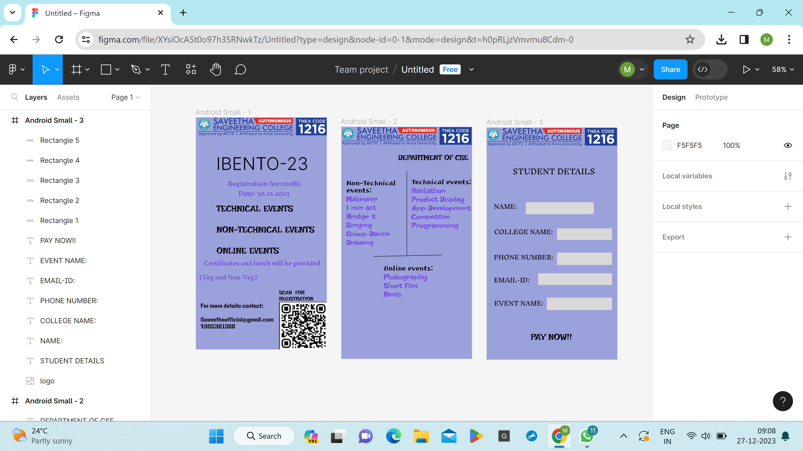

# Ex09 Event Registration Web Application
## Date:27.12.2023

## AIM:
To design, develop and deploy a web application for event registration.

## DESIGN STEPS:

### Step 1:
Create a new frame.

### Step 2:
Select any one preset size of your choice.

### Step 3:
Select the shapes you need.

### Step 4:
Import images as needed.

### Step 5:
Create pages based on your need and link them.

### Step 6:

Validate the HTML and CSS code.

### Step 6:

Publish the website in the given URL.

## DESIGN TOOL:
Figma

## CODE:
```
Home Page
<div style="width: 100%; height: 100%; position: relative; background: #9BA1DB">
    
    <div style="width: 293px; height: 50px; left: 29px; top: 99px; position: absolute; color: black; font-size: 48px; font-family: Inter; font-weight: 300; word-wrap: break-word">  IBENTO-23</div>
    <div style="width: 221px; height: 41px; left: 70px; top: 162px; position: absolute; color: #7138E8; font-size: 16px; font-family: Inknut Antiqua; font-weight: 400; word-wrap: break-word">    Registration fee:100Rs</div>
    <div style="width: 145px; height: 55px; left: 117px; top: 189px; position: absolute; color: #7138E8; font-size: 16px; font-family: Inknut Antiqua; font-weight: 400; word-wrap: break-word">Date: 30.12.2023</div>
    
    <div style="width: 275px; height: 176px; left: 57px; top: 237px; position: absolute; color: black; font-size: 24px; font-family: Irish Grover; font-weight: 400; word-wrap: break-word">TECHNICAL EVENTS<br/><br/>NON-TECHNICAL EVENTS<br/><br/>ONLINE EVENTS</div>
    <div style="width: 360px; height: 78px; left: 10px; top: 382px; position: absolute; color: #7138E8; font-size: 15px; font-family: Inknut Antiqua; font-weight: 400; word-wrap: break-word">   Certificates and lunch will be provided (Veg and Non-Veg)</div>
    <div style="width: 131px; height: 34px; left: 229px; top: 475px; position: absolute; color: black; font-size: 14px; font-family: Irish Grover; font-weight: 400; word-wrap: break-word">SCAN  FOR  REGISTRATION</div>
    <div style="width: 209px; height: 108px; left: 13px; top: 509px; position: absolute; color: black; font-size: 16px; font-family: Keania One; font-weight: 400; word-wrap: break-word">For more details contact:            <br/><br/>Saveethaofficial@gmail.com<br/>7305361388</div>
</div>
//   IBENTO-23
color: black;
 font-size: 48px;
 font-family: Inter;
 font-weight: 300;
 word-wrap: break-word
---
//     Registration fee:100Rs
color: #7138E8;
 font-size: 16px;
 font-family: Inknut Antiqua;
 font-weight: 400;
 word-wrap: break-word
---
// Date: 30.12.2023
color: #7138E8;
 font-size: 16px;
 font-family: Inknut Antiqua;
 font-weight: 400;
 word-wrap: break-word
---
// TECHNICAL EVENTS<br/><br/>NON-TECHNICAL EVENTS<br/><br/>ONLINE EVENTS
color: black;
 font-size: 24px;
 font-family: Irish Grover;
 font-weight: 400;
 word-wrap: break-word
---
//    Certificates and lunch will be provided (Veg and Non-Veg)
color: #7138E8;
 font-size: 15px;
 font-family: Inknut Antiqua;
 font-weight: 400;
 word-wrap: break-word
---
// SCAN  FOR  REGISTRATION
color: black;
 font-size: 14px;
 font-family: Irish Grover;
 font-weight: 400;
 word-wrap: break-word
---
// For more details contact:            <br/><br/>Saveethaofficial@gmail.com<br/>7305361388
color: black;
 font-size: 16px;
 font-family: Keania One;
 font-weight: 400;
 word-wrap: break-word


Page2
<div style="width: 100%; height: 100%; position: relative; background: #9BA1DB">
    
    <div style="width: 143px; height: 195px; left: 14px; top: 146px; position: absolute"><span style="color: black; font-size: 20px; font-family: JejuHallasan; font-weight: 400; word-wrap: break-word">Non-Technical events:<br/></span><span style="color: #7138E8; font-size: 20px; font-family: Irish Grover; font-weight: 400; word-wrap: break-word">Makeover<br/>1 min act<br/>Bridge it<br/>Singing<br/>Group Dance<br/>Drawing</span></div>
    <div style="width: 153px; height: 159px; left: 117px; top: 381px; position: absolute"><span style="color: black; font-size: 20px; font-family: JejuHallasan; font-weight: 400; word-wrap: break-word">Online events:<br/></span><span style="color: #7138E8; font-size: 20px; font-family: Irish Grover; font-weight: 400; word-wrap: break-word">Photography<br/>Short Film<br/>Reels</span></div>
    <div style="width: 166px; height: 174px; left: 194px; top: 143px; position: absolute"><span style="color: black; font-size: 20px; font-family: JejuHallasan; font-weight: 400; word-wrap: break-word">Technical events:<br/></span><span style="color: #7138E8; font-size: 20px; font-family: Irish Grover; font-weight: 400; word-wrap: break-word">Hackathon<br/>Product Display<br/>App Development<br/>Competitive Programming</span></div>
    <div style="width: 235px; height: 0px; left: 180px; top: 121px; position: absolute; transform: rotate(90deg); transform-origin: 0 0; border: 1px black solid"></div>
    <div style="width: 188.04px; height: 0px; left: 89px; top: 358px; position: absolute; transform: rotate(-1.22deg); transform-origin: 0 0; border: 1px black solid"></div>
    <div style="width: 279px; height: 26px; left: 157px; top: 73px; position: absolute; color: black; font-size: 20px; font-family: Irish Grover; font-weight: 400; word-wrap: break-word">DEPARTMENT OF CSE</div>
</div>
// Non-Technical events:<br/>
color: black;
 font-size: 20px;
 font-family: JejuHallasan;
 font-weight: 400;
 word-wrap: break-word
---
// Makeover<br/>1 min act<br/>Bridge it<br/>Singing<br/>Group Dance<br/>Drawing
color: #7138E8;
 font-size: 20px;
 font-family: Irish Grover;
 font-weight: 400;
 word-wrap: break-word
---
// Online events:<br/>
color: black;
 font-size: 20px;
 font-family: JejuHallasan;
 font-weight: 400;
 word-wrap: break-word
---
// Photography<br/>Short Film<br/>Reels
color: #7138E8;
 font-size: 20px;
 font-family: Irish Grover;
 font-weight: 400;
 word-wrap: break-word
---
// Technical events:<br/>
color: black;
 font-size: 20px;
 font-family: JejuHallasan;
 font-weight: 400;
 word-wrap: break-word
---
// Hackathon<br/>Product Display<br/>App Development<br/>Competitive Programming
color: #7138E8;
 font-size: 20px;
 font-family: Irish Grover;
 font-weight: 400;
 word-wrap: break-word
---
// DEPARTMENT OF CSE
color: black;
 font-size: 20px;
 font-family: Irish Grover;
 font-weight: 400;
 word-wrap: break-word

Page3
<div style="width: 100%; height: 100%; position: relative; background: #9BA1DB">
    
    <div style="width: 264px; height: 42px; left: 72px; top: 95px; position: absolute; color: black; font-size: 20px; font-family: Inknut Antiqua; font-weight: 400; word-wrap: break-word">STUDENT DETAILS</div>
    <div style="width: 72px; height: 30px; left: 20px; top: 197px; position: absolute; color: black; font-size: 16px; font-family: Inknut Antiqua; font-weight: 400; word-wrap: break-word">NAME:</div>
    <div style="width: 174px; height: 30px; left: 21px; top: 267px; position: absolute; color: black; font-size: 16px; font-family: Inknut Antiqua; font-weight: 400; word-wrap: break-word">COLLEGE NAME:</div>
    <div style="width: 168px; height: 35px; left: 20px; top: 337px; position: absolute; color: black; font-size: 16px; font-family: Inknut Antiqua; font-weight: 400; word-wrap: break-word">PHONE NUMBER:</div>
    <div style="width: 164px; height: 33px; left: 20px; top: 400px; position: absolute; color: black; font-size: 16px; font-family: Inknut Antiqua; font-weight: 400; word-wrap: break-word">EMAIL-ID:</div>
    <div style="width: 183px; height: 44px; left: 21px; top: 464px; position: absolute; color: black; font-size: 16px; font-family: Inknut Antiqua; font-weight: 400; word-wrap: break-word">EVENT NAME:</div>
    <div style="width: 144px; height: 38px; left: 122px; top: 563px; position: absolute; color: black; font-size: 24px; font-family: Irish Grover; font-weight: 400; word-wrap: break-word">PAY NOW!!</div>
    <div style="width: 187px; height: 33px; left: 108px; top: 206px; position: absolute; background: #D9D9D9"></div>
    <div style="width: 151px; height: 32px; left: 194px; top: 278px; position: absolute; background: #D9D9D9"></div>
    <div style="width: 151px; height: 34px; left: 194px; top: 345px; position: absolute; background: #D9D9D9"></div>
    <div style="width: 203px; height: 32px; left: 142px; top: 402px; position: absolute; background: #D9D9D9"></div>
    <div style="width: 179px; height: 34px; left: 166px; top: 469px; position: absolute; background: #D9D9D9"></div>
</div>
// STUDENT DETAILS
color: black;
 font-size: 20px;
 font-family: Inknut Antiqua;
 font-weight: 400;
 word-wrap: break-word
---
// NAME:
color: black;
 font-size: 16px;
 font-family: Inknut Antiqua;
 font-weight: 400;
 word-wrap: break-word
---
// COLLEGE NAME:
color: black;
 font-size: 16px;
 font-family: Inknut Antiqua;
 font-weight: 400;
 word-wrap: break-word
---
// PHONE NUMBER:
color: black;
 font-size: 16px;
 font-family: Inknut Antiqua;
 font-weight: 400;
 word-wrap: break-word
---
// EMAIL-ID:
color: black;
 font-size: 16px;
 font-family: Inknut Antiqua;
 font-weight: 400;
 word-wrap: break-word
---
// EVENT NAME:
color: black;
 font-size: 16px;
 font-family: Inknut Antiqua;
 font-weight: 400;
 word-wrap: break-word
---
// PAY NOW!!
color: black;
 font-size: 24px;
 font-family: Irish Grover;
 font-weight: 400;
 word-wrap: break-word

```
## OUTPUT:


## RESULT:
The program to design, develop and deploy a web application for event registration is completed successfully.
